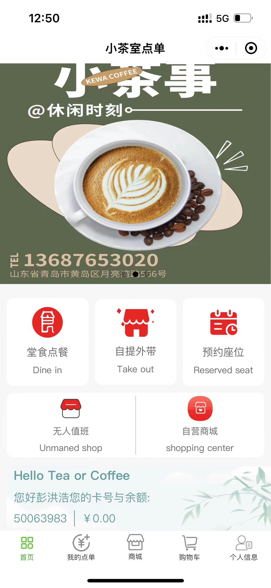
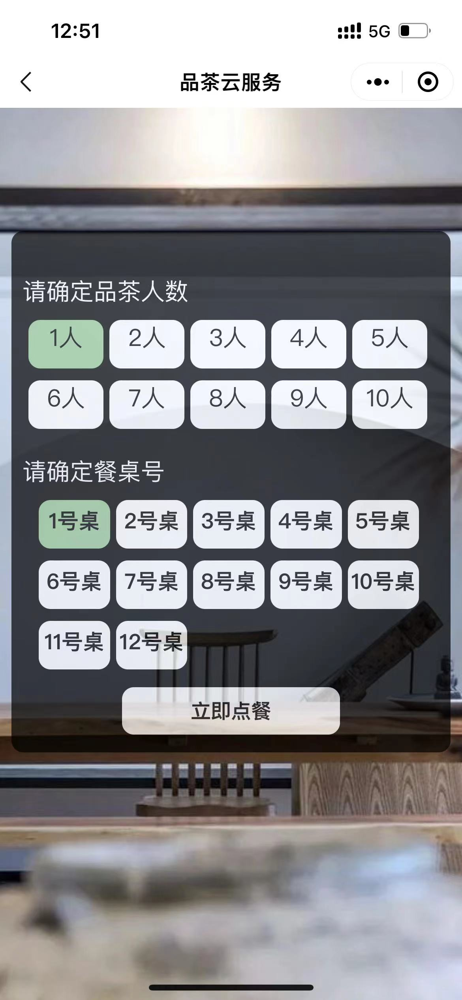
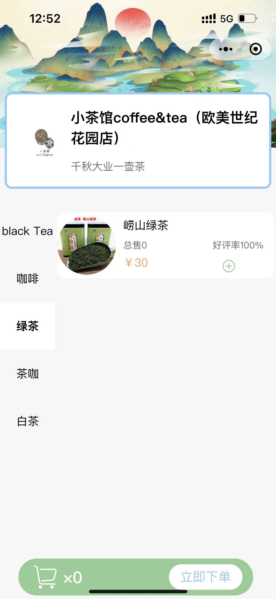
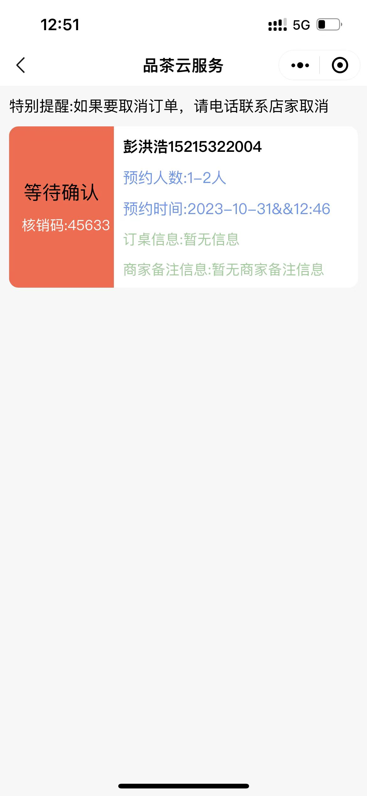
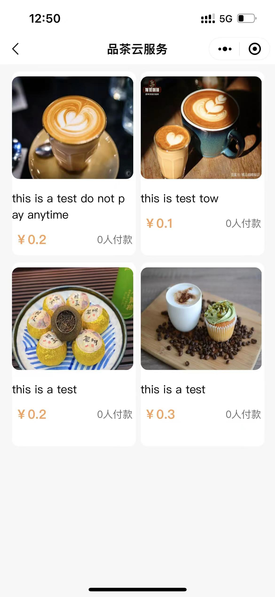
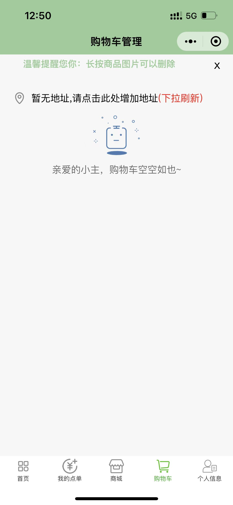
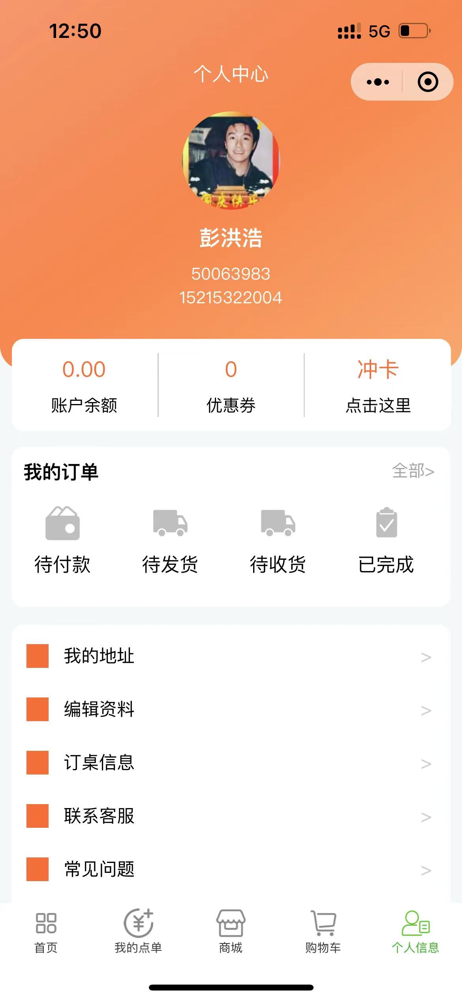
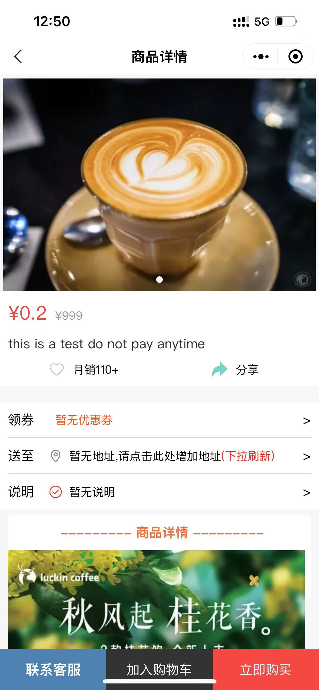
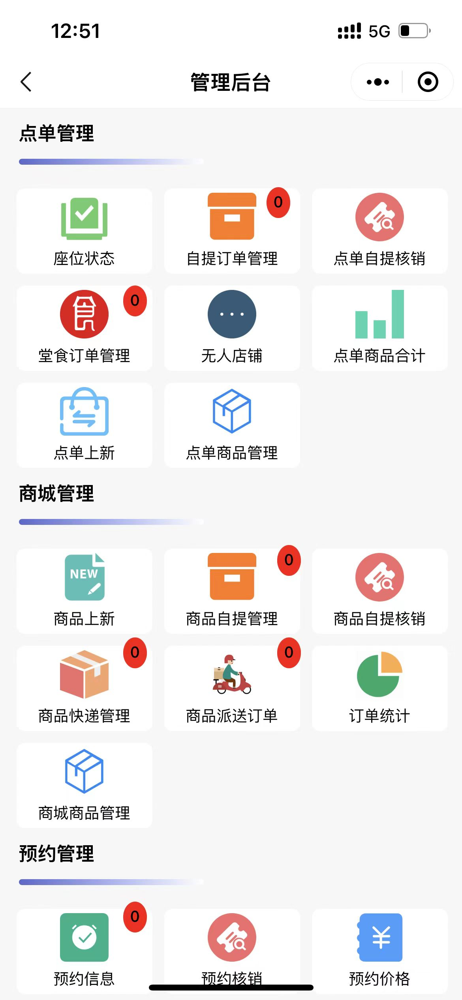
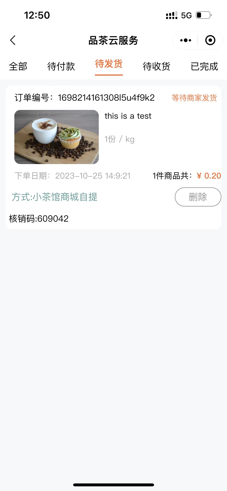

# 小程序功能结构

## 一、	用户端	

### 1、点单	

#### 	1.1、堂食点餐	

#### 	1.2、自提外带	

### 2、商城	

### 3、预约座位	

### 4、无人值班

### 5、充值卡	

## 二、后台端	

### 1、点单管理	

#### 	1.1座位状态	

#### 	1.2自提订单管理	

#### 	1.3自提核销	

#### 	1.4堂食订单管理	

#### 	1.5无人店铺（后期更新）	

#### 	1.6点单上新	

#### 	1.7点单商品管理	

### 2、商城管理	

#### 	2.1、商品上新	

#### 	2.2、商品自提管理	

#### 	2.3、商品自提核销	

#### 	2.4、商品快递管理	

#### 	2.5、商品派送订单	

#### 	2.6、商品派送费用规则	

#### 	2.7、商城商品管理	

### 3、预约管理	

#### 	3.1、预约信息	

#### 	3.2、预约核销	

#### 	3.3、预约价格	

### 4、用户信息	

#### 	4.1、为用户充值	

#### 	4.2、用户基本信息	

#### 	4.3、充值规则设置	

### 5、后台数据	

# 搭建部署

已经实现支付接口，可商用、可毕设

正在打造本小程序的开发教学：从0到1微信小程序点单开发

需要搭建部署同款的兄弟可以添加微：A2020brave

更多项目可以微扫码进入社区：

# 小程序展示图片

